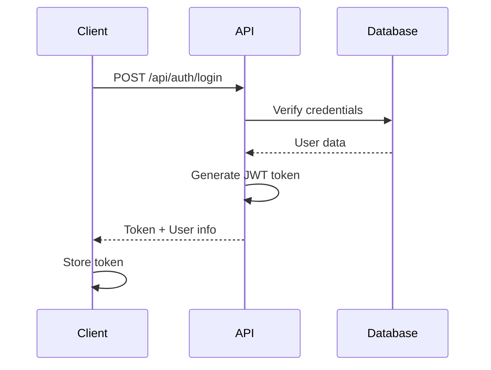
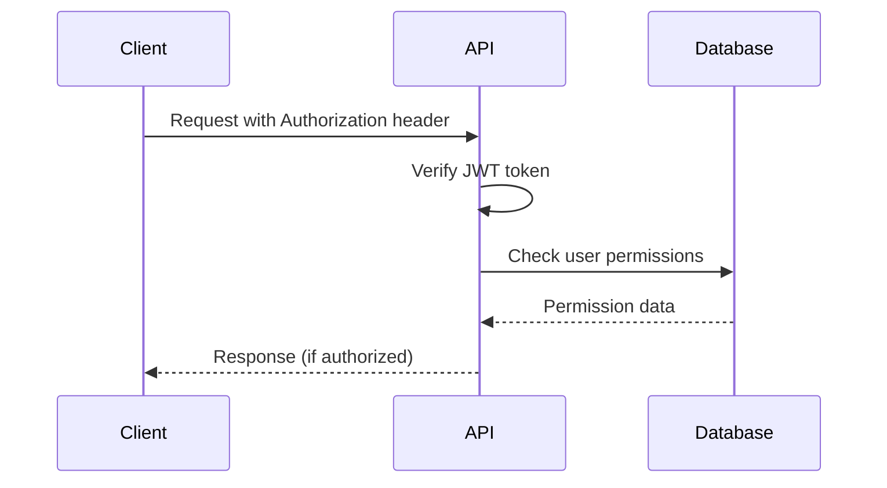

# Authentication API

## 🔐 Authentication Overview

The Creamingo API uses JWT (JSON Web Token) based authentication to secure access to protected endpoints. The authentication system supports role-based access control with two main roles: Super Admin and Staff.

## 🔑 Authentication Flow

### 1. Login Process



### 2. Authenticated Request Flow



## 📋 Authentication Endpoints

### Login

#### Endpoint
```
POST /api/auth/login
```

#### Description
Authenticates a user and returns a JWT token for subsequent requests.

#### Request Body

```json
{
  "email": "admin@creamingo.com",
  "password": "password123"
}
```

#### Field Validation

| Field | Type | Required | Validation |
|-------|------|----------|------------|
| `email` | string | Yes | Valid email format |
| `password` | string | Yes | Minimum 6 characters |

#### Example Request

```javascript
const response = await fetch('/api/auth/login', {
  method: 'POST',
  headers: {
    'Content-Type': 'application/json'
  },
  body: JSON.stringify({
    email: 'admin@creamingo.com',
    password: 'password123'
  })
});

const data = await response.json();
if (data.success) {
  const token = data.data.token;
  localStorage.setItem('authToken', token);
}
```

#### Example Response

```json
{
  "success": true,
  "message": "Login successful",
  "data": {
    "user": {
      "id": 1,
      "name": "Super Admin",
      "email": "admin@creamingo.com",
      "role": "super_admin",
      "avatar": null,
      "is_active": true,
      "last_login": "2024-01-15T10:30:00Z",
      "created_at": "2024-01-01T00:00:00Z",
      "updated_at": "2024-01-15T10:30:00Z"
    },
    "token": "eyJhbGciOiJIUzI1NiIsInR5cCI6IkpXVCJ9..."
  }
}
```

#### Error Responses

##### Invalid Credentials
```json
{
  "success": false,
  "message": "Invalid email or password"
}
```

##### Account Deactivated
```json
{
  "success": false,
  "message": "Account is deactivated. Please contact administrator."
}
```

### Register

#### Endpoint
```
POST /api/auth/register
```

#### Description
Creates a new user account. Typically used for creating staff accounts.

#### Request Body

```json
{
  "name": "John Doe",
  "email": "john@creamingo.com",
  "password": "password123",
  "role": "staff"
}
```

#### Field Validation

| Field | Type | Required | Validation |
|-------|------|----------|------------|
| `name` | string | Yes | 1-100 characters |
| `email` | string | Yes | Valid email format, unique |
| `password` | string | Yes | Minimum 6 characters |
| `role` | string | No | Must be 'staff' or 'super_admin' (default: 'staff') |

#### Example Request

```javascript
const response = await fetch('/api/auth/register', {
  method: 'POST',
  headers: {
    'Content-Type': 'application/json',
    'Authorization': `Bearer ${adminToken}`
  },
  body: JSON.stringify({
    name: "John Doe",
    email: "john@creamingo.com",
    password: "password123",
    role: "staff"
  })
});
```

#### Example Response

```json
{
  "success": true,
  "message": "User registered successfully",
  "data": {
    "user": {
      "id": 2,
      "name": "John Doe",
      "email": "john@creamingo.com",
      "role": "staff",
      "created_at": "2024-01-15T10:30:00Z"
    },
    "token": "eyJhbGciOiJIUzI1NiIsInR5cCI6IkpXVCJ9..."
  }
}
```

#### Error Responses

##### Email Already Exists
```json
{
  "success": false,
  "message": "User with this email already exists"
}
```

### Get Current User

#### Endpoint
```
GET /api/auth/me
```

#### Description
Retrieves information about the currently authenticated user.

#### Headers

| Header | Value | Required |
|--------|-------|----------|
| `Authorization` | `Bearer <token>` | Yes |

#### Example Request

```javascript
const response = await fetch('/api/auth/me', {
  headers: {
    'Authorization': `Bearer ${token}`
  }
});
```

#### Example Response

```json
{
  "success": true,
  "data": {
    "id": 1,
    "name": "Super Admin",
    "email": "admin@creamingo.com",
    "role": "super_admin",
    "avatar": null,
    "last_login": "2024-01-15T10:30:00Z",
    "created_at": "2024-01-01T00:00:00Z",
    "updated_at": "2024-01-15T10:30:00Z"
  }
}
```

#### Error Responses

##### Invalid Token
```json
{
  "success": false,
  "message": "Invalid or expired token"
}
```

##### User Not Found
```json
{
  "success": false,
  "message": "User not found"
}
```

### Update Profile

#### Endpoint
```
PUT /api/auth/profile
```

#### Description
Updates the current user's profile information.

#### Headers

| Header | Value | Required |
|--------|-------|----------|
| `Authorization` | `Bearer <token>` | Yes |

#### Request Body

```json
{
  "name": "Updated Name",
  "email": "newemail@creamingo.com",
  "avatar": "https://example.com/avatar.jpg"
}
```

#### Field Validation

| Field | Type | Required | Validation |
|-------|------|----------|------------|
| `name` | string | No | 1-100 characters |
| `email` | string | No | Valid email format, unique |
| `avatar` | string | No | Valid URL or null |

#### Example Request

```javascript
const response = await fetch('/api/auth/profile', {
  method: 'PUT',
  headers: {
    'Content-Type': 'application/json',
    'Authorization': `Bearer ${token}`
  },
  body: JSON.stringify({
    name: "Updated Name",
    email: "newemail@creamingo.com"
  })
});
```

#### Example Response

```json
{
  "success": true,
  "message": "Profile updated successfully",
  "data": {
    "id": 1,
    "name": "Updated Name",
    "email": "newemail@creamingo.com",
    "role": "super_admin",
    "avatar": null,
    "last_login": "2024-01-15T10:30:00Z",
    "created_at": "2024-01-01T00:00:00Z",
    "updated_at": "2024-01-15T11:00:00Z"
  }
}
```

#### Error Responses

##### Email Already Taken
```json
{
  "success": false,
  "message": "Email is already taken"
}
```

### Change Password

#### Endpoint
```
PUT /api/auth/change-password
```

#### Description
Changes the current user's password.

#### Headers

| Header | Value | Required |
|--------|-------|----------|
| `Authorization` | `Bearer <token>` | Yes |

#### Request Body

```json
{
  "currentPassword": "oldpassword123",
  "newPassword": "newpassword123"
}
```

#### Field Validation

| Field | Type | Required | Validation |
|-------|------|----------|------------|
| `currentPassword` | string | Yes | Current password |
| `newPassword` | string | Yes | Minimum 6 characters |

#### Example Request

```javascript
const response = await fetch('/api/auth/change-password', {
  method: 'PUT',
  headers: {
    'Content-Type': 'application/json',
    'Authorization': `Bearer ${token}`
  },
  body: JSON.stringify({
    currentPassword: "oldpassword123",
    newPassword: "newpassword123"
  })
});
```

#### Example Response

```json
{
  "success": true,
  "message": "Password changed successfully"
}
```

#### Error Responses

##### Incorrect Current Password
```json
{
  "success": false,
  "message": "Current password is incorrect"
}
```

### Logout

#### Endpoint
```
POST /api/auth/logout
```

#### Description
Logs out the current user. In the current implementation, this is handled client-side by removing the token.

#### Headers

| Header | Value | Required |
|--------|-------|----------|
| `Authorization` | `Bearer <token>` | Yes |

#### Example Request

```javascript
const response = await fetch('/api/auth/logout', {
  method: 'POST',
  headers: {
    'Authorization': `Bearer ${token}`
  }
});

// Client-side logout
localStorage.removeItem('authToken');
```

#### Example Response

```json
{
  "success": true,
  "message": "Logged out successfully"
}
```

## 🔒 JWT Token Details

### Token Structure

JWT tokens consist of three parts separated by dots:

```
eyJhbGciOiJIUzI1NiIsInR5cCI6IkpXVCJ9.eyJ1c2VySWQiOjEsImlhdCI6MTY0MDk5NTIwMCwiZXhwIjoxNjQxNTk5MjAwfQ.signature
```

### Token Payload

```json
{
  "userId": 1,
  "iat": 1640995200,
  "exp": 1641599200
}
```

### Token Configuration

| Setting | Value | Description |
|---------|-------|-------------|
| Algorithm | HS256 | HMAC SHA-256 |
| Expiration | 7 days | Token validity period |
| Secret | Environment variable | JWT signing secret |
| Issuer | Creamingo API | Token issuer |

### Token Security

- **Secret Key**: Stored in environment variables
- **Expiration**: Automatic token expiration
- **Algorithm**: Secure HMAC SHA-256
- **Validation**: Server-side token verification

## 👥 User Roles and Permissions

### Role Definitions

#### Super Admin
- **Description**: Full system access and administration
- **Permissions**: All operations including user management and system settings
- **Access**: Complete admin panel functionality

#### Staff
- **Description**: Limited operational access
- **Permissions**: Product and order management, no user or system administration
- **Access**: Restricted admin panel functionality

### Permission Matrix

| Resource | Super Admin | Staff |
|----------|-------------|-------|
| Products | Full CRUD | View, Edit |
| Categories | Full CRUD | View, Edit |
| Orders | Full CRUD | View, Edit |
| Users | Full CRUD | View only |
| Settings | Full CRUD | No access |
| Featured Content | Full CRUD | No access |
| File Upload | Full access | Limited access |

### Role-Based Access Control Implementation

```javascript
// Middleware example
const requireRole = (roles) => {
  return (req, res, next) => {
    if (!req.user) {
      return res.status(401).json({ message: 'Authentication required' });
    }
    
    if (!roles.includes(req.user.role)) {
      return res.status(403).json({ message: 'Insufficient permissions' });
    }
    
    next();
  };
};

// Usage
app.get('/api/users', authMiddleware, requireRole(['super_admin']), getUsers);
```

## 🛡️ Security Features

### Password Security

#### Hashing Algorithm
- **Algorithm**: bcrypt
- **Salt Rounds**: 12
- **Storage**: Hashed passwords only

#### Password Requirements
- **Minimum Length**: 6 characters
- **Recommendation**: 8+ characters with mixed case, numbers, and symbols

### Session Security

#### Token Storage
- **Client Storage**: localStorage or sessionStorage
- **Server Storage**: No server-side session storage
- **Stateless**: JWT tokens are stateless

#### Token Validation
- **Signature Verification**: HMAC SHA-256 verification
- **Expiration Check**: Automatic token expiration
- **User Validation**: Active user status check

### Security Headers

```javascript
// Security middleware configuration
app.use(helmet({
  contentSecurityPolicy: {
    directives: {
      defaultSrc: ["'self'"],
      styleSrc: ["'self'", "'unsafe-inline'"],
      scriptSrc: ["'self'"],
      imgSrc: ["'self'", "data:", "https:"],
    },
  },
  hsts: {
    maxAge: 31536000,
    includeSubDomains: true,
    preload: true
  }
}));
```

## 🚨 Error Handling

### Authentication Errors

#### 401 Unauthorized
```json
{
  "success": false,
  "message": "Authentication required"
}
```

#### 403 Forbidden
```json
{
  "success": false,
  "message": "Insufficient permissions"
}
```

#### Token Expired
```json
{
  "success": false,
  "message": "Token has expired"
}
```

#### Invalid Token
```json
{
  "success": false,
  "message": "Invalid token"
}
```

### Validation Errors

#### 422 Unprocessable Entity
```json
{
  "success": false,
  "message": "Validation failed",
  "error": {
    "code": "VALIDATION_ERROR",
    "details": {
      "email": "Email is required",
      "password": "Password must be at least 6 characters"
    }
  }
}
```

## 🔧 Client-Side Implementation

### Token Management

```javascript
class AuthService {
  constructor() {
    this.token = localStorage.getItem('authToken');
  }

  async login(email, password) {
    const response = await fetch('/api/auth/login', {
      method: 'POST',
      headers: {
        'Content-Type': 'application/json'
      },
      body: JSON.stringify({ email, password })
    });

    const data = await response.json();
    
    if (data.success) {
      this.token = data.data.token;
      localStorage.setItem('authToken', this.token);
      return data.data.user;
    }
    
    throw new Error(data.message);
  }

  logout() {
    this.token = null;
    localStorage.removeItem('authToken');
  }

  getAuthHeaders() {
    return this.token ? {
      'Authorization': `Bearer ${this.token}`
    } : {};
  }

  async makeAuthenticatedRequest(url, options = {}) {
    const headers = {
      ...this.getAuthHeaders(),
      ...options.headers
    };

    const response = await fetch(url, {
      ...options,
      headers
    });

    if (response.status === 401) {
      this.logout();
      window.location.href = '/login';
      return;
    }

    return response;
  }
}
```

### React Hook Example

```javascript
import { useState, useEffect, createContext, useContext } from 'react';

const AuthContext = createContext();

export const AuthProvider = ({ children }) => {
  const [user, setUser] = useState(null);
  const [loading, setLoading] = useState(true);
  const [token, setToken] = useState(localStorage.getItem('authToken'));

  useEffect(() => {
    if (token) {
      fetchUser();
    } else {
      setLoading(false);
    }
  }, [token]);

  const fetchUser = async () => {
    try {
      const response = await fetch('/api/auth/me', {
        headers: {
          'Authorization': `Bearer ${token}`
        }
      });

      if (response.ok) {
        const data = await response.json();
        setUser(data.data);
      } else {
        logout();
      }
    } catch (error) {
      console.error('Auth error:', error);
      logout();
    } finally {
      setLoading(false);
    }
  };

  const login = async (email, password) => {
    const response = await fetch('/api/auth/login', {
      method: 'POST',
      headers: {
        'Content-Type': 'application/json'
      },
      body: JSON.stringify({ email, password })
    });

    const data = await response.json();
    
    if (data.success) {
      setToken(data.data.token);
      setUser(data.data.user);
      localStorage.setItem('authToken', data.data.token);
      return data.data.user;
    }
    
    throw new Error(data.message);
  };

  const logout = () => {
    setToken(null);
    setUser(null);
    localStorage.removeItem('authToken');
  };

  const value = {
    user,
    token,
    login,
    logout,
    loading
  };

  return (
    <AuthContext.Provider value={value}>
      {children}
    </AuthContext.Provider>
  );
};

export const useAuth = () => {
  const context = useContext(AuthContext);
  if (!context) {
    throw new Error('useAuth must be used within an AuthProvider');
  }
  return context;
};
```

## 📊 Security Best Practices

### Server-Side Security

1. **Environment Variables**: Store JWT secret in environment variables
2. **Password Hashing**: Use bcrypt with appropriate salt rounds
3. **Input Validation**: Validate all input data
4. **Rate Limiting**: Implement rate limiting on auth endpoints
5. **HTTPS**: Use HTTPS in production
6. **Token Expiration**: Set appropriate token expiration times

### Client-Side Security

1. **Secure Storage**: Use secure storage for tokens
2. **Token Refresh**: Implement token refresh mechanism
3. **Automatic Logout**: Logout on token expiration
4. **HTTPS Only**: Only send tokens over HTTPS
5. **XSS Protection**: Sanitize user input
6. **CSRF Protection**: Implement CSRF protection

### Monitoring and Logging

1. **Login Attempts**: Log all login attempts
2. **Failed Logins**: Monitor failed login attempts
3. **Token Usage**: Track token usage patterns
4. **Security Events**: Log security-related events
5. **Audit Trail**: Maintain audit trail for user actions

This comprehensive authentication API documentation covers all aspects of the authentication system, from basic login/logout functionality to advanced security features and client-side implementation examples.
